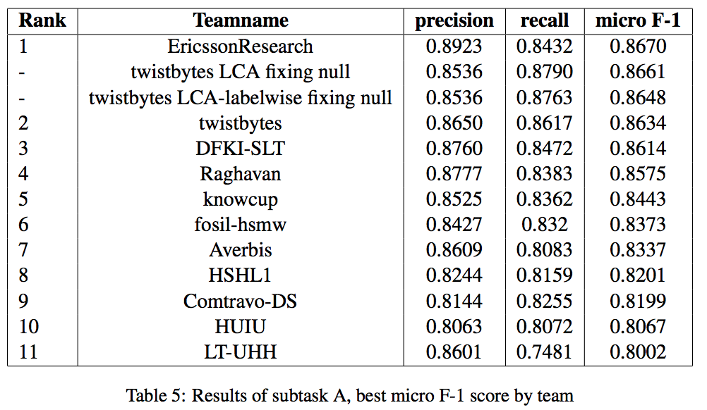
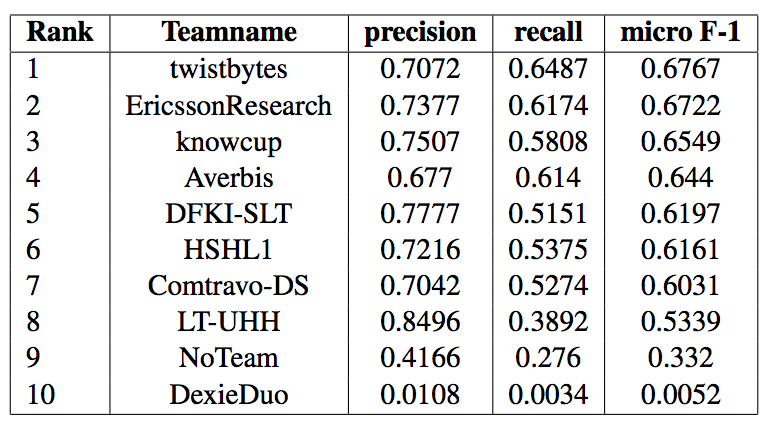

## GermEval 2019 Task 1 - Shared Task on Hierarchical Classification of Blurbs

This repository contains the code for the participation on GermEval 2019 Task 1 -- Shared task on hierarchical classification of blurbs.

Our team achieved the 9th place in Sub-Task A and 7th place in Sub-Task B, many improvements could have been made, and the code here can be the starting point for more experiments.

You can see on the images below the results for both tasks achieved by all participating teams.

  
  

You can read the papers of both best winners here:
 - TODO
 - TODO

---

### To run the experiments first install:

    pip install -r requirements.txt
    
    wget https://s3.eu-central-1.amazonaws.com/alan-nlp/resources/embeddings-v0.4/de-wiki-fasttext-300d-1M.vectors.npy
    wget https://s3.eu-central-1.amazonaws.com/alan-nlp/resources/embeddings-v0.4/de-wiki-fasttext-300d-1M
    
    python -m nltk.downloader punkt
    python -m nltk.downloader stopwords

### The following files run experiments for different strategies:

    subtask_a.py
    
    subtask_b_local_classifier.py
    
    subtask_b_global_classifier.py
    
    
### Evaluating an experiment:

    score.sh
    
    
### Competition data and evaluation scripts are available through codalab:

- [https://competitions.codalab.org/competitions/20139](https://competitions.codalab.org/competitions/20139)
